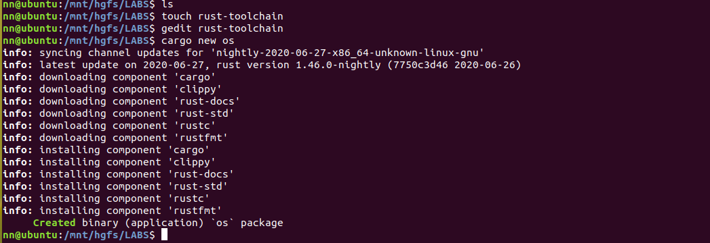
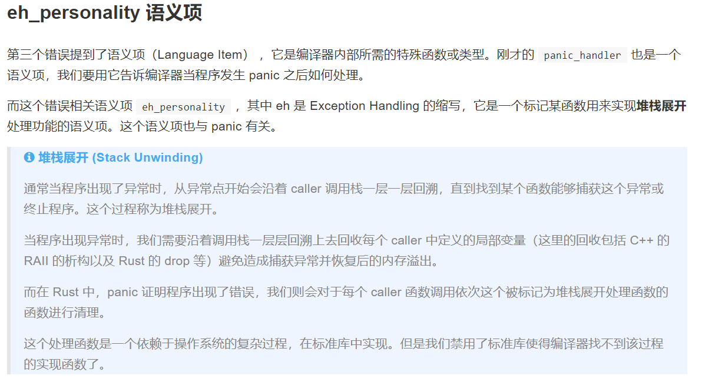
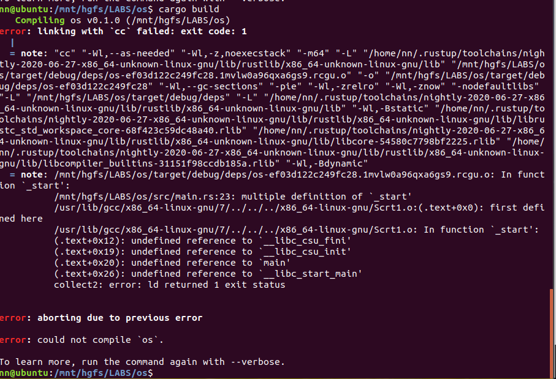
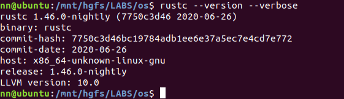
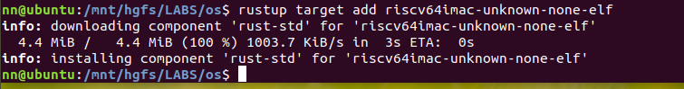
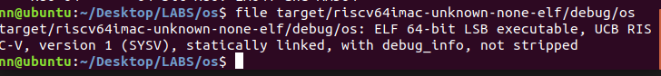
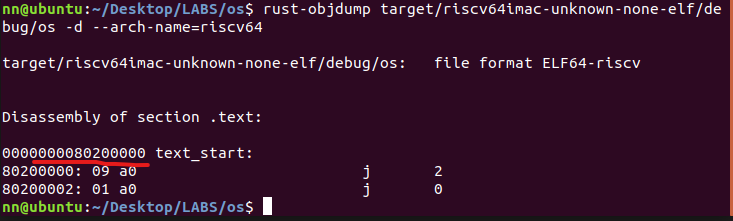
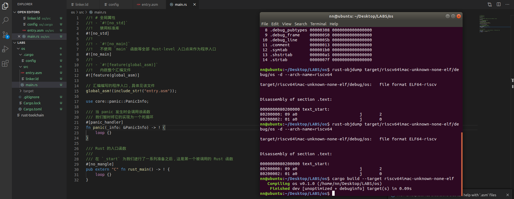
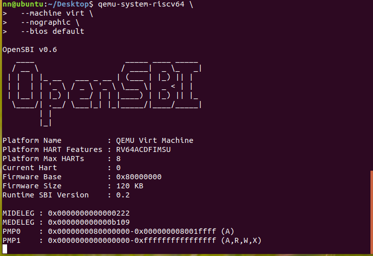
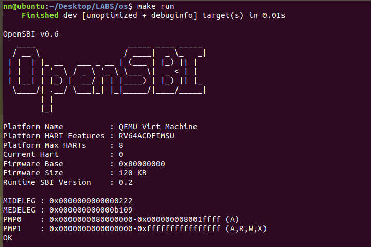

> 以下内容通过参考如下实验指导完成
https://rcore-os.github.io/rCore-Tutorial-deploy/docs/lab-0/guide/part-5.html 

### 创建项目

### 移除标准库依赖

### 移除运行时环境依赖

### 编译为裸机目标 

为了描述不同的环境，Rust 使用一个称为目标三元组（Target Triple）的字符串 ```<arch><sub>-<vendor>-<sys>-<abi>```。要查看当前系统的目标三元组，我们可以运行 rustc --version --verbose：
它包含了 CPU 架构 x86_64、供应商 unknown、操作系统 linux 和二进制接口 gnu。



### 生成内核镜像
```shell
$ cargo install cargo-binutils  
$ rustup component add llvm-tools-preview
```

cargo build
```shell
$ cargo build --target riscv64imac-unknown-none-elf
```
查看程序属性信息  

> rust-objdump -x 来查看程序的元信息
```
$ rust-objdump target/riscv64imac-unknown-none-elf/debug/os -x --arch-name=riscv64

target/riscv64imac-unknown-none-elf/debug/os:	file format ELF64-riscv

architecture: riscv64
start address: 0x0000000000011120

Program Header:
    PHDR off    0x0000000000000040 vaddr 0x0000000000010040 paddr 0x0000000000010040 align 2**3
         filesz 0x00000000000000e0 memsz 0x00000000000000e0 flags r--
    LOAD off    0x0000000000000000 vaddr 0x0000000000010000 paddr 0x0000000000010000 align 2**12
         filesz 0x0000000000000120 memsz 0x0000000000000120 flags r--
    LOAD off    0x0000000000000120 vaddr 0x0000000000011120 paddr 0x0000000000011120 align 2**12
         filesz 0x0000000000000004 memsz 0x0000000000000004 flags r-x
   STACK off    0x0000000000000000 vaddr 0x0000000000000000 paddr 0x0000000000000000 align 2**64
         filesz 0x0000000000000000 memsz 0x0000000000000000 flags rw-

Dynamic Section:
Sections:
Idx Name            Size     VMA              Type
  0                 00000000 0000000000000000 
  1 .text           00000004 0000000000011120 TEXT
  2 .debug_str      000003fe 0000000000000000 
  3 .debug_abbrev   00000113 0000000000000000 
  4 .debug_info     0000053c 0000000000000000 
  5 .debug_aranges  00000040 0000000000000000 
  6 .debug_ranges   00000030 0000000000000000 
  7 .debug_pubnames 000000a4 0000000000000000 
  8 .debug_pubtypes 00000308 0000000000000000 
  9 .debug_frame    00000050 0000000000000000 
 10 .debug_line     0000005b 0000000000000000 
 11 .comment        00000013 0000000000000000 
 12 .symtab         00000108 0000000000000000 
 13 .shstrtab       000000a5 0000000000000000 
 14 .strtab         0000002d 0000000000000000 

SYMBOL TABLE:
0000000000000000 l    df *ABS*	00000000 3gqd1qcioyc9uzqc
0000000000011120         .text	00000000 
0000000000011120         .text	00000000 
0000000000011120         .text	00000000 
0000000000011124         .text	00000000 
0000000000000000         .debug_info	00000000 
0000000000000000         .debug_ranges	00000000 
0000000000000000         .debug_frame	00000000 
0000000000000000         .debug_line	00000000 .Lline_table_start0
0000000000011120 g     F .text	00000004 _start
```

Program Header：程序加载时所需的段信息
其中的 off 是它在文件中的位置，vaddr 和 paddr 是要加载到的虚拟地址和物理地址，align 规定了地址的对齐，filesz 和 memsz 分别表示它在文件和内存中的大小，flags 描述了相关权限（r 表示可读，w 表示可写，x 表示可执行）

> rust-objdump -d 来对代码进行反汇编：
```
$ rust-objdump target/riscv64imac-unknown-none-elf/debug/os -d --arch-name=riscv64

target/riscv64imac-unknown-none-elf/debug/os:	file format ELF64-riscv


Disassembly of section .text:

0000000000011120 _start:
   11120: 09 a0                        	j	2
   11122: 01 a0                        	j	0

```

#### + 生成镜像
$ rust-objcopy target/riscv64imac-unknown-none-elf/debug/os --strip-all -O binary target/riscv64imac-unknown-none-elf/debug/kernel.bin
> --strip-all 表明丢弃所有符号表及调试信息，-O binary 表示输出为二进制文件

### 调整内存布局
#### + 程序的内存布局

一般来说，一个程序按照功能不同会分为下面这些段：  
**.text** 段：代码段，存放汇编代码  
**.rodata** 段：只读数据段，顾名思义里面存放只读数据，通常是程序中的常量  
**.data** 段：存放被初始化的可读写数据，通常保存程序中的全局变量  
**.bss** 段：存放被初始化为 0 的可读写数据，与 .data 段的不同之处在于我们知道它要被初始化为 0，因此在可执行文件中只需记录这个段的大小以及所在位置即可，而不用记录里面的数据，也不会实际占用二进制文件的空间  
**Stack**：栈，用来存储程序运行过程中的局部变量，以及负责函数调用时的各种机制。它从高地址向低地址增长  
**Heap**：堆，用来支持程序运行过程中内存的动态分配，比如说你要读进来一个字符串，在你写程序的时候你也不知道它的长度究竟为多少，于是你只能在运行过程中，知道了字符串的长度之后，再在堆中给这个字符串分配内存


新的内存布局：
> _start位于 x80200000



### 重写程序入口点 _start
  + OpenSBI运行在 RISC-V 64 的 M Mode（CPU 加电后也就运行在 M Mode），
  + 我们将要实现的 OS 内核运行在 S Mode
  + 而我们要支持的用户程序运行在 U Mode。

  > OpenSBI 所做的一件事情就是把 CPU 从 M Mode 切换到 S Mode，接着跳转到一个固定地址 0x80200000，开始执行内核代码。


 

### 使用 QEMU 运行内核 

+ [从QEMU-5.0.0源代码编译支持RISC-V](http://www.nuanyun.cloud/?p=591)
+ 使用 OpenSBI   
 

```shell
qemu-system-riscv64 \
            -machine virt \
            -nographic \
            -bios default \
            -device loader,file=$(BIN_FILE),addr=0x80200000
```
> 这里我们通过参数 -device 来将内核镜像加载到 QEMU 中，我们指定了内核镜像文件，并告诉 OpenSBI 最后跳转到 0x80200000 这个入口地址。

   

可以看到“OK”从rust_main输出