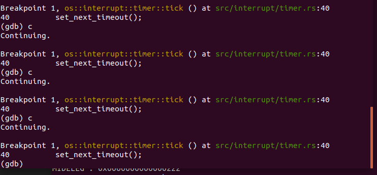

> 以下内容通过参考如下实验指导完成
https://rcore-os.github.io/rCore-Tutorial-deploy/docs/lab-1/guide/part-3.html 

### RISCV::CSR寄存器学习

### 保存中断处理前的Context（os/src/interrupt/context.rs）
需要保存所有:
+ 通用寄存器，
+ sepc、scause 和 stval 这三个会被硬件自动写入的 CSR 寄存器，
+ 以及 sstatus。（因为中断可能会涉及到权限的切换，以及中断的开关，这些都会修改 sstatus。）

保存这些寄存器的内容采用如下结构体定义的方式：
```rust
pub struct Context {
    pub x: [usize; 32],     // 32 个通用寄存器
    pub sstatus: Sstatus,
    pub sepc: usize
}
```

以上结构体的定义需要额外调用一些在 rCore 中的库 riscv 封装的一些寄存器操作
需要在Cargo.toml中添加依赖
riscv = { git = "https://github.com/rcore-os/riscv", features = ["inline-asm"] }

用法为：
```rust
use riscv::register::{sstatus::Sstatus};
```
### 状态的保存与恢复(os/src/interrupt/interrupt.asm)
64位RISV-通用寄存器大小为64Bit.
> 因此offset要✖8

```shell
    # 宏：将寄存器存到栈上
    .macro SAVE reg, offset
        sd  \reg, \offset*8(sp)
    .endm

    # 宏：将寄存器从栈中取出
    .macro LOAD reg, offset
        ld  \reg, \offset*8(sp)
    .endm

```

```shell
    # 在栈上开辟 Context 所需的空间
    addi    sp, sp, -34*8
```

```shell
# 将原来的 sp（sp 又名 x2）写入 2 位置(因为开辟空间后的sp已经发生了变化)
    addi    x1, sp, 34*8
    SAVE    x1, 2
```

```shell
    # 取出 CSR 并保存
    csrr    s1, sstatus
    csrr    s2, sepc
    SAVE    s1, 32
    SAVE    s2, 33
```

```shell
    # 调用 handle_interrupt，传入参数
    # context: &mut Context
    mv      a0, sp
    # scause: Scause
    csrr    a1, scause
    # stval: usize
    csrr    a2, stval
    jal  handle_interrupt
```

### 开启中断 （os/src/interrupt/handler.rs）

```rust
/// 把中断入口 `__interrupt` 写入 `stvec` 中，并且开启中断使能
pub fn init() {
    unsafe {
        extern "C" {
            /// `interrupt.asm` 中的中断入口
            fn __interrupt();
        }
        // 使用 Direct 模式，将中断入口设置为 `__interrupt`
        stvec::write(__interrupt as usize, stvec::TrapMode::Direct);
    }
}
```

### 处理中断 （os/src/interrupt/handler.rs）
编写中断处理流程 handle_interrupt()：
```rust
/// 中断的处理入口
/// 
/// `interrupt.asm` 首先保存寄存器至 Context，其作为参数和 scause 以及 stval 一并传入此函数
/// 具体的中断类型需要根据 scause 来推断，然后分别处理
#[no_mangle]
pub fn handle_interrupt(context: &mut Context, scause: Scause, stval: usize) {
    panic!("Interrupted: {:?}", scause.cause());
}
```

### 时钟中断

参考
https://rcore-os.github.io/rCore-Tutorial-deploy/docs/lab-1/guide/part-6.html
为“OS”设置时钟中断

handle_interrupt函数中国可以通过 Debug 来查看发生了什么中断
```rust
match scause.cause() {
        // 断点中断（ebreak）
        Trap::Exception(Exception::Breakpoint) => breakpoint(context),
        // 时钟中断
        Trap::Interrupt(Interrupt::SupervisorTimer) => supervisor_timer(context),
        // 其他情况，终止当前线程
        _ => fault(context, scause, stval),
    }
```

更新（os/src/interrupt/mod.rs）
```rust 
//! 中断模块
//! 
//! 

mod handler;
mod context;
mod timer;
/// 初始化中断相关的子模块
/// 
/// - [`handler::init`]
/// - [`timer::init`]
pub fn init() {
    handler::init();
    timer::init();//新增的timer初始化
    // println!("mod interrupt initialized");
}
```

这里引用了的rCore的sbi接口 （rCore-master\rCore-master\kernel\src\arch\riscv\sbi.rs）

```rust
/// 设置下一次时钟中断的时间
pub fn set_timer(time: usize) {
    sbi_call(SBI_SET_TIMER, time, 0, 0);
}


#[inline(always)]
fn sbi_call(which: usize, arg0: usize, arg1: usize, arg2: usize) -> usize {
    let ret;
    unsafe {
        llvm_asm!("ecall"
            : "={x10}" (ret)
            : "{x10}" (arg0), "{x11}" (arg1), "{x12}" (arg2), "{x17}" (which)
            : "memory"
            : "volatile");
    }
    ret
}
```
<span id="gdb"></span>
> "OS"运行后用GDB调试可见Timer有效，可正常的实现sysTick功能




### 安装 riscv64-unknown-elf-gdb


GDB源代码下载地址：
https://mirrors.tuna.tsinghua.edu.cn/gnu/gdb/?C=M&O=D
参考步骤从源代码编译安装riscv64-unknown-elf-gdb
https://rcore-os.github.io/rCore-Tutorial-deploy/docs/pre-lab/gdb.html
此后便可以使用它了：


### GDB调试手动方式：

将 QEMU 的运行参数加上 -s -S，它将在 1234 端口等待调试器接入
运行 riscv64-unknown-elf-gdb
在 GDB 中执行 file target/riscv64imac-unknown-none-elf/debug/os 来加载未被 strip 过的内核文件中的各种符号
在 GDB 中执行 target remote localhost:1234 来连接 QEMU，开始调试
在makefile中添加qemu以gdb运行的新方式


> 在外部直接指定需要debug的文件  


### GDB 调试  

1. 将断点设定在rust_main,并执行到此处  

  

2. 这是现有该函数内的具体代码
```rust
pub extern "C" fn rust_main() -> ! {
    // 在屏幕上输出 "OK\n" ，随后进入死循环
    console_putchar(b'O');
    console_putchar(b'K');
    console_putchar(b'\n');
    // 初始化各种模块
    interrupt::init();

    unsafe {
        llvm_asm!("ebreak"::::"volatile");
    };

    
    loop {}
    unreachable!();

    
}
```
3. 继续设置断点并运行到到interrupt_handler  

  

> 从GDB调试情况来看，OS可以正常进入中断处理函数


