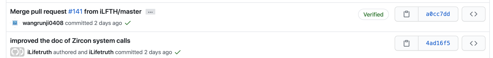
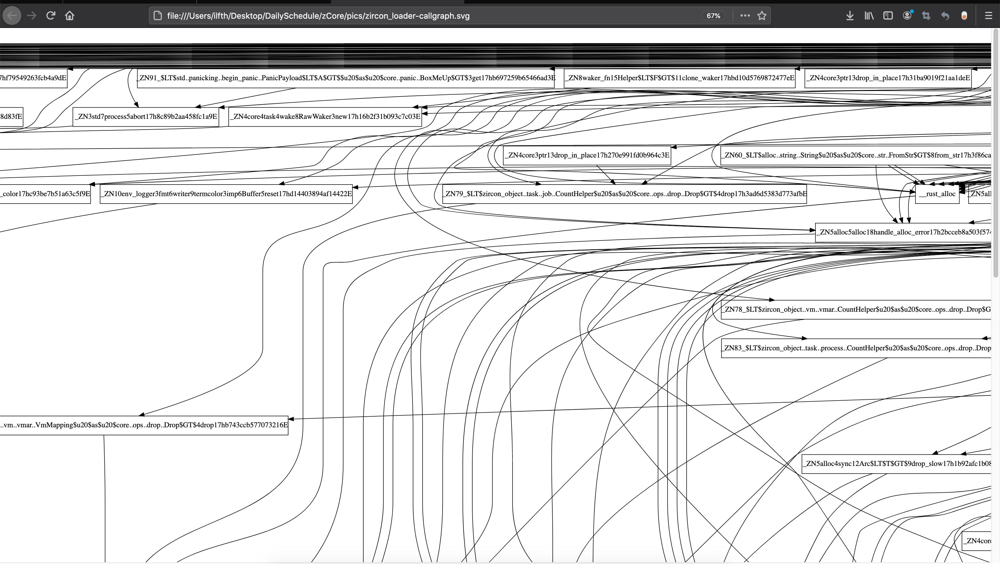

# Daily Schedule/Summary-2
---
## Links
+ [OS Tutorial Summer of Code](https://github.com/rcore-os/rCore/wiki/os-tutorial-summer-of-code)
+ [Daily Schedule ++](https://github.com/rcore-os/rCore-Tutorial/issues/18)
<!-- + [Web](http://www.nuanyun.cloud) -->
<span id="TOC"></span>  

<!-- ## Tags

- [RISC-V](http://www.nuanyun.cloud/?tag=riscv) 
- [Rust](http://www.nuanyun.cloud/?tag=rust)
- [Qemu](http://www.nuanyun.cloud/?tag=qemu)
- [LLVM](http://www.nuanyun.cloud/?tag=)  -->

## TOC

 *2020 八月*                

| Mon                    | Tues                   | Wed                    | Thur                   | Fri                    | Sat                    | Sun                    |
|------------------------|------------------------|------------------------|------------------------|------------------------|------------------------|------------------------|
| | | | | | [1](#1)|[2](#2)|
|[3](#3)|[4](#4)|[5](#5)|[6](#6)|[7](#7)|[8](#8)|[9](#9)|
|[10](#10)|[11](#11)|[12](#12)|[13](#13)|[14](#GITHUB)|15(#GITHUB)|16(#GITHUB)|
|[17](#GITHUB)|[18](#GITHUB)|[19](#GITHUB)|[20](#GITHUB)|[21](#GITHUB)|[22](#GITHUB)|[23](#GITHUB)|
|[24](#GITHUB)|[25](#GITHUB)|[26](#GITHUB)|[27](#GITHUB)|[28](#GITHUB)|29|30|
|31|

## Pages
> It is used to describe some learning details(blogs).  
## (Step2)Daily Summary


<span id="1"></span>
### [↑](#TOC)Day 1 (8.3)
Todo:

#### zCore 的文档与单元测试完善
* 项目标题
zCore 的文档与单元测试完善

* 项目描述
zCore 是用 Rust 重新实现的 Zircon 微内核。目前我们已经按照官方文档的描述，实现了诸多 Zircon 内核对象，支持运行 shell 等基础程序。然而，随着后期开发进程的加快，大量代码缺少文档描述，并且没有实现单元测试，只能在 QEMU 中运行用户程序以检验代码正确性。本项目的目标是完善 zCore 的文档及单元测试，使其成为一个高质量的 Rust 社区项目。

* 项目产出
补充完善 zCore 各模块的代码文档。

> 1. 目标是通过 #![deny(missing_docs)] 编译，并且能够让开发者通过阅读文档，快速理解 zCore 的代码结构和各部分功能。

> 2. 参考 Fuchsia 官方文档及测试代码，为 zCore 中的内核对象补充单元测试。目标让 zircon-object 模块的测试覆盖率提高到 90% 以上。
> 3. （可选）在 CI 中支持运行集成测试。 目标是最大化整体的测试覆盖率。

> 4. （可选）在zCore中添加zircon/linux的syscall。 目标：完善添加zCore内核功能，让zCore通过更多的zircon tests(基于zircon的coretest)或Linux tests（基于musl libc的libc test）或相关应用

相关的开源软件仓库列表：

https://github.com/rcore-os/zCore （zCore 仓库）
https://rcore-os.github.io/zCore/zircon_object （zCore 代码文档）
https://fuchsia.dev/fuchsia-src/reference （Zircon 官方文档）

相关

---


<span id="2"></span>
### [↑](#TOC)Day 2 (8.4)

#### 阅读毕业设计《zCore 操作系统内核的设计与实现》


#### 现有的zCore 文档主要从这些方面展开描述（以及代码索引）

1. 内核对象
1.1. 初识内核对象   
1.2. 对象管理器：Process 对象       <zircon-object\src\task\process.rs>  job/process/thread  
1.3. 对象传送器：Channel 对象       <zircon-object\src\ipc\channel.rs>  
2. 任务管理                        <zircon-object\src\task>  
2.1. Zircon 任务管理体系            <>  
2.2. 硬件抽象层与``异步运行时``      <kernel_hal(bare)> async 《zCore 操作系统内核的设计与实现》中有相关描述  
2.3. 线程管理：Thread 对象          <zircon-object\src\task\thread.rs>std::thread(8.4日)  
2.4. 进程管理：Process 与 Job 对象  <zircon-object\src\task\job.rs>  <zircon-object\src\task\job_policy.rs>  
3. 内存管理  
3.1. Zircon 内存管理模型  
3.2. 物理内存：VMO 对象             <zircon-object\src\vm\vmo\physical.rs>   
3.3. 虚拟内存：VMAR 对象            <zircon-object\src\vm\vmar.rs>  
4. 用户程序
4.1. Zircon 用户程序                
4.2. 加载 ELF 文件                  <zircon-object\src\util\elf_loader.rs>  
4.3. 上下文切换                     
4.4. 系统调用                       <zircon-syscall\src>
#### zCore项目整理架构


#### 个人打算文档的编写依据如下线路编写?(LibOS)  
Linux/MacOS  ->  
kernel-hal-unix ->   
kernel-hal ->  
zircon-object/syscall/loader  


#### 文档其他没有被包含的内容  
+ boot相关？(8.5放到后面写)  
+ linux-loader/busybox(8.5助教说暂时可以不用看)  
+ baremental <zCore\src\arch\x86_64\linker.ld>section之间的4K对齐描述  
#### zCore 整体设计（Fuchsia）  
[前期调研](http://os.cs.tsinghua.edu.cn/oscourse/OsTrain2019/g1)  
zCore是微内核结构  
+ zCore立项背景  
支持各种linux System Call  
+ 测试集  
功能测试: Core Tests  
BENCHMARK:  QEMU-KVM 1 CPU测试  
            cargo bench  
+ 类似make weak  
(all)user mode  
#### async  
无栈协程，协作式调度  
C++/C#/python/JS  
BLOGOS:paper!  
tokio/async-std  

---


<span id="3"></span>
### [↑](#TOC)Day 3 (8.5)  

#### 1. 继续整理zCore文档中各个章节和zCore源代码的对应关系
#### 2. 文档编辑分工（初步）
#### 3. 本地zCore的实际试运行与观察
#### 4. 建立了新的github repo:[🔗](https://github.com/Lincyaw/zcore_tutorial_developers.git)
#### 5. 开始编辑 zCore程序(ELF加载与动态链接 相关文档

---

<span id="4"></span>
<span id="5"></span>
### [↑](#TOC)Day 4/5 (8.6-7)  

[文档仓库连接](https://github.com/rcore-os/zcore_tutorial_developers/tree/master/ch04-%E7%94%A8%E6%88%B7%E7%A8%8B%E5%BA%8F)


###  第一阶段

#### 小组成员
小组成员：荣悦同、卢睿博、张驰斌、张文龙、彭晓、方澳阳、姚宇飞
细分：合作者为张文龙，彭晓  

#### 目标实现 
在理解zCore现有源程序各个模块源代码的基础上，编写解释zCore的说明书。

#### 任务分工

- [内核对象](ch01-00-object.md)
- [任务管理](ch02-00-task.md)
- [内存管理](ch03-00-memory.md)
- [用户程序](ch04-00-userspace.md)
    - [Zircon 用户程序](ch04-01-user-program.md)
    - [zCore加载 ELF 文件的流程与方式(已经写了一部分)](ch04-02-load-elf.md)
    - [上下文切换](ch04-03-context-switch.md)
    - [系统调用](ch04-04-syscall.md)  
	


#### 个人负责的部分：  
+ 用户程序ELF文件的加载流程说明(可能需要结合任务管理) 
+ zricon_syscall系统调用的说明
    + 第一步 代码内注释文档编写。(预计)
    + 第二步 外部文档编写。  
    + 第三步 用户态和内核态之间使用系统调用的流程。  
	+ 第四步 编写syscall的测试用例代码
	+ 第五步 绘制syscall CallGraph
	
> 方法一：
> 方法二：  

    ```rust
    sys_bti_create
    sys_bti_pin
    sys_bti_release_quarantine
    sys_channel_call_finish
    sys_channel_call_noretry
    sys_channel_create
    sys_channel_read
    sys_channel_write
    sys_channel_write_etc
    sys_clock_adjust
    sys_clock_create
    sys_clock_get
    sys_clock_read
    sys_clock_update
    sys_cprng_draw_once
    sys_create_exception_channel
    sys_debug_read
    sys_debug_write
    sys_debuglog_create
    sys_debuglog_read
    sys_debuglog_write
    sys_event_create
    sys_eventpair_create
    sys_exception_get_process
    sys_exception_get_thread
    sys_fifo_create
    sys_fifo_read
    sys_fifo_write
    sys_futex_requeue
    sys_futex_wait
    sys_futex_wake
    sys_futex_wake_single_owner
    sys_handle_close
    sys_handle_close_many
    sys_handle_duplicate
    sys_handle_replace
    sys_interrupt_ack
    sys_interrupt_bind
    sys_interrupt_create
    sys_interrupt_destroy
    sys_interrupt_trigger
    sys_interrupt_wait
    sys_iommu_create
    sys_job_create
    sys_job_set_critical
    sys_job_set_policy
    sys_nanosleep
    sys_object_get_child
    sys_object_get_info
    sys_object_get_property
    sys_object_set_property
    sys_object_signal
    sys_object_signal_peer
    sys_object_wait_async
    sys_object_wait_many
    sys_object_wait_one
    sys_pc_firmware_tables
    sys_pci_add_subtract_io_range
    sys_pci_cfg_pio_rw
    sys_pci_config_read
    sys_pci_config_write
    sys_pci_enable_bus_master
    sys_pci_get_bar
    sys_pci_get_nth_device
    sys_pci_init
    sys_pci_map_interrupt
    sys_pci_query_irq_mode
    sys_pci_set_irq_mode
    sys_pmt_unpin
    sys_port_create
    sys_port_queue
    sys_port_wait
    sys_process_create
    sys_process_exit
    sys_process_read_memory
    sys_process_start
    sys_process_write_memory
    sys_resource_create
    sys_socket_create
    sys_socket_read
    sys_socket_shutdown
    sys_socket_write
    sys_stream_create
    sys_stream_readv
    sys_stream_readv_at
    sys_stream_seek
    sys_stream_writev
    sys_stream_writev_at
    sys_system_get_event
    sys_task_kill
    sys_task_suspend_token
    sys_thread_create
    sys_thread_exit
    sys_thread_start
    sys_thread_write_state
    sys_timer_cancel
    sys_timer_create
    sys_timer_set
    sys_vmar_allocate
    sys_vmar_destroy
    sys_vmar_map
    sys_vmar_protect
    sys_vmar_unmap
    sys_vmo_cache_policy
    sys_vmo_create
    sys_vmo_create_child
    sys_vmo_create_contiguous
    sys_vmo_create_physical
    sys_vmo_get_size
    sys_vmo_op_range
    sys_vmo_read
    sys_vmo_replace_as_executable
    sys_vmo_set_size
    sys_vmo_write
    syscall
    ```
[fuchsia链接](https://fuchsia.dev/fuchsia-src/reference/syscalls/fifo_create) 

#### 第二阶段
> 经过小组成员的合作分工，此时zCore的具体实现细节已经基本上呈现。能对系统的架构比较熟悉。


<span id="7"></span>
### [↑](#TOC)Day 6 (8.7)  

#### 1. 上午报告个人任务安排
#### 2. 下午分析zCore系统调用写法
---

<span id="8"></span>
### [↑](#TOC)Day 7 (8.8)  

#### 1. 参加完活动，从深圳乘坐动车🚄返回杭州
---


<span id="9"></span>
### [↑](#TOC)Day 8 (8.9)  

#### 1. 总结上周的所见所闻
#### 2. 把现有的Workspace从Windows转移到MacOS上来
#### 3. 周末处理学校相关的事情（迎新系统，通过相关考核）
---


<span id="10"></span>
<span id="11"></span>
### [↑](#TOC)Day 9/10/ (8.10-11)  

#### 1. 在zircon-syscall/src目录下添加各个syscall的内嵌注释文档
+ pci.rs内实现的系统调用需要结合HAL，为此我可能需要深入了解zCore/kernel-hal下的内容
---

<span id="12"></span>
### [↑](#TOC)Day 11 (8.12)  

#### 完善各个zircon syscall的内嵌注释文本
+ 根据助教给出的建议进行相应的文档修改，主要是格式方面的问题。
+ 提交pull request（已merge）
  

    
---

<span id="13"></span>
### [↑](#TOC)Day 12 (8.13)  

#### 1. 检查整理一些zCore中未实现的系统调用
> 在Fuchsia.dev出现，但是zCore中还存有Todo的部分。

#### 2. 尝试为VMO.rs模块添加单元测试
    
#### [Fuchsia OS 学习资料& 教程汇总](https://fuchsia.dev/fuchsia-src/reference/syscalls/interrupt_ack)

<!-- #### [Fuchsia 最新源码包下载](https://mirrors.sirung.org/fuchsia/source-code/)
+ 对比Zircon在C语言和Rust语言实现上的异同 -->
---


+ 内存映射MMIO,PCI规范
+ 添加系统调用的单元测试中
  


### [↑](#TOC)Day ** 
<span id="GITHUB"></span>

### https://github.com/rcore-os/zcore_tutorial_developers/commits/master

+ added doc about ch04-User-program::The process of writing system-calls
iLifetruth authored and iLifetruth committed 34 seconds ago
d3d25f9

+ updated doc for ch03-memory::Zircon-Memory
iLifetruth authored and iLifetruth committed yesterday
8ec3386  

+ updated doc about the relationship between Fuchsia&Zircon
iLifetruth authored and iLifetruth committed 42 seconds ago
3f499a1  

+ updated doc about fuchisa OS
iLifetruth authored and iLifetruth committed 37 minutes ago
80d39e8  

+ added doc about ch04-User-program::How to build prebuild Zircon images
iLifetruth authored and iLifetruth committed 2 minutes ago
cf3cd7b  

+ Discribed the relationship between Fuchsia OS and Zircon kernel
iLifetruth authored and iLifetruth committed 2 days ago
919655a  

+ started added doc about ch04-User-program::vDSO_syacall
iLifetruth authored and iLifetruth committed 3 minutes ago
83c3922  

+ added doc about ch04-User-program::vDSO's intro
iLifetruth authored and iLifetruth committed 36 minutes ago
f00ad14  

+ started added doc about ch04-User-program::vDSO
iLifetruth authored and iLifetruth committed 2 days ago
af5a608  

+ added doc about how does ch04-User-program::run_userboot load an elf 
iLifetruth authored and iLifetruth committed 2 days ago
21b52a9  
+ dded doc about ch04-User-program::BOOTFS
iLifetruth authored and iLifetruth committed 2 days ago
46810c5  

+ added doc for ch04-User-program::userboot
iLifetruth authored and iLifetruth committed 2 days ago
122f3d7  

### zCore::zircon-loader Callgraph的生成

1. 生成bitcode
rustc --crate-name zircon_syscall --edition=2018 zircon-syscall/src/lib.rs --error-format=json --json=diagnostic-rendered-ansi --crate-type lib --emit=dep-info,metadata,link,llvm-bc -C opt-level=3 -Cembed-bitcode=no -C metadata=d5577fa10de1b216 -C extra-filename=-d5577fa10de1b216 --out-dir /home/nn/Desktop/zCore/target/release/deps -L dependency=/home/nn/Desktop/zCore/target/release/deps --extern bitflags=/home/nn/Desktop/zCore/target/release/deps/libbitflags-37a18e2d7537f304.rmeta --extern futures=/home/nn/Desktop/zCore/target/release/deps/libfutures-fa2fd8b18975a102.rmeta --extern kernel_hal=/home/nn/Desktop/zCore/target/release/deps/libkernel_hal-92535ee7135e9794.rmeta --extern log=/home/nn/Desktop/zCore/target/release/deps/liblog-b79f4ccba9ad9b93.rmeta --extern numeric_enum_macro=/home/nn/Desktop/zCore/target/release/deps/libnumeric_enum_macro-321e14d6e78a9ec2.rmeta --extern spin=/home/nn/Desktop/zCore/target/release/deps/libspin-d2bbec489fe7afc6.rmeta --extern zircon_object=/home/nn/Desktop/zCore/target/release/deps/libzircon_object-30082ccb6cfd54ac.rmeta

2. 安装llvm9
3. 获得callgraph的dot图
```json
	Node0x23ce8c0 -> Node0x2a4c8c0;
	Node0x23ce8c0 -> Node0x24b2bc0;
	Node0x23cbe10 [shape=record,label="{_ZN112_$LT$alloc..collections..btree..map..IntoIter$LT$K$C$V$GT$$u20$as$u20$core..iter..traits..iterator..Iterator$GT$4next17hf16d85d31df664a9E}"];
	Node0x23cbe10 -> Node0x23c9780;
	Node0x23cbe10 -> Node0x23cece0;
	Node0x23d4c50 [shape=record,label="{_ZN10kernel_hal4user21UserPtr$LT$u8$C$P$GT$11read_string17h2e7fb3bb56db4638E}"];
	Node0x23d4c50 -> Node0x23ca7b0;
	Node0x23d4c50 -> Node0x23d3820;
	Node0x23d4c50 -> Node0x23d1650;
	Node0x23d4c50 -> Node0x23d4eb0;
	Node0x23d4c50 -> Node0x23d3820;
	Node0x23d4c50 -> Node0x23cf780;
	Node0x2728ad0 [shape=record,label="{_ZN43_$LT$T$u20$as$u20$downcast_rs..Downcast$GT$11into_any_rc17h7ad7e4f982c061edE}"];
	Node0x2728b40 [shape=record,label="{_ZN43_$LT$T$u20$as$u20$downcast_rs..Downcast$GT$11into_any_rc17h89bbdf50176c37c0E}"];
	Node0x2728bb0 [shape=record,label="{_ZN43_$LT$T$u20$as$u20$downcast_rs..Downcast$GT$11into_any_rc17h8f980db55ba0f0e5E}"];
	Node0x2490280 [shape=record,label="{_ZN43_$LT$T$u20$as$u20$downcast_rs..Downcast$GT$11into_any_rc17ha2b67106364a2854E}"];
	Node0x24902f0 [shape=record,label="{_ZN43_$LT$T$u20$as$u20$downcast_rs..Downcast$GT$11into_any_rc17hac3441ffed62fc96E}"];
	Node0x2490360 [shape=record,label="{_ZN43_$LT$T$u20$as$u20$downcast_rs..Downcast$GT$11into_any_rc17hb396af96a8247407E}"];
	Node0x24903d0 [shape=record,label="{_ZN43_$LT$T$u20$as$u20$downcast_rs..Downcast$GT$11into_any_rc17hbc847035656928d8E}"];
	Node0x2490440 [shape=record,label="{_ZN43_$LT$T$u20$as$u20$downcast_rs..Downcast$GT$11into_any_rc17hbe5bf331812892d5E}"];
```

4. 转化为svg图（zCore/pics/callgraph.svg）
5. 用浏览器打开查看



