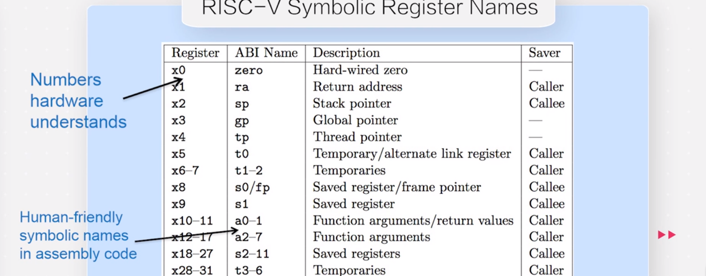

# Daily Schedule/Summary
---
## Links
+ [OS Tutorial Summer of Code](https://github.com/rcore-os/rCore/wiki/os-tutorial-summer-of-code)
+ [Daily Schedule ++](https://github.com/rcore-os/rCore-Tutorial/issues/18)
+ [iLFTH's Web](http://www.nuanyun.cloud)
<span id="TOC"></span>  

## Tags

- [RISC-V](http://www.nuanyun.cloud/?tag=riscv) 
- [Rust](http://www.nuanyun.cloud/?tag=rust)
- [Qemu](http://www.nuanyun.cloud/?tag=qemu)
- [LLVM](http://www.nuanyun.cloud/?tag=) 

## TOC


 *2020七月*                

| Mon                    | Tues                   | Wed                    | Thur                   | Fri                    | Sat                    | Sun                    |
|------------------------|------------------------|------------------------|------------------------|------------------------|------------------------|------------------------|
|     |    | 1  | 2  | [3](#1)  | [4](#2)     | [5](#3)     |
| [6](#4)   | [7](#5)  | [8](#6)  | [9](#8)  | [10](#8) | [11](#8) | [12](#10) |
| [13](#13)  | [14](#14) | [15](#15) | 16 | 17 | 18 | 19 |
| 20  | 21 | 22 | 23 | 24 | 25 | 26 |
| 27  | 28 | 29 | 30 | 31 |                        |    [*其他**](RUST/docs/T/mark.md)               |

 *2020 八月*                

| Mon                    | Tues                   | Wed                    | Thur                   | Fri                    | Sat                    | Sun                    |
|------------------------|------------------------|------------------------|------------------------|------------------------|------------------------|------------------------|
| | | | | | 1|2|
|3|4|5|6|7|8|9|
|10|11|12|13|14|15|16|
|17|18|19|20|21|22|23|
|24|25|26|27|28|29|30|
|31|

## Pages
> It is used to describe some learning details(blogs).


## Daily Summary


<span id="1"></span>
### [↑](#TOC)Day 0 (7.3)
学习办公环境整理，搬寝室
建立此repo

---
<span id="2"></span>
### [↑](#TOC)Day 1 (7.4)
#### 1. rust编程语言环境配置
参考阅读《Rust 程序设计语言》简体中文版，在linux/macos上安装rustup  
latest update on 2020-06-18, rust version 1.44.1  
能够运行一些样例程序
#### 2. 理解常见rust编程概念
+ 不可变变量（与常量的区别）
+ 数据类型，及类型注释方法
  - rust术语：Rust panic 它用于程序因错误而退出的情况。  
  - 编译器会对未使用的变量绑定产生警告；可以给变量名加上下划线前缀来消除警告。
+ 变量/常量/函数名命名规范
+ 函数定义方式（传参/返回值的写法）
+ 函数定义内：表达式和语句的区别
+ 了解rust的控制流写法（if/loop/while/for）
  - 同时归纳与C语言写法的一些差异


---
<span id="3"></span>
### [↑](#TOC)Day 2 (7.5)    

#### 1. 阅读《通过例子学 Rust》
+ [文档注释方法](https://rustwiki.org/zh-CN/rust-by-example/meta/doc.html)
+ 格式化输出
+ 原生类型/自定义类型
+ 了解rust的剩余控制流写法
    - match
    - if/while let
+ 学习rust 链表写法([示例](RUST/Toy_Srcs/List.rs))基于enum
+ 类型系统
    - 可以用 type 语句给已有的类型取个新的名字。类型的名字必须遵循驼峰命名法（像是 CamelCase 这样），否则编译器将给出错误。示例如下：
        ```rust
        type NanoSecond = u64;
        type Inch = u64;
        ```
    - 类型转换：use std::convert::From;  
        ```rust
        let my_str = "hello";
        let my_string = String::from(my_str);
        // &str常见形式是字符串字面量 
        // String基于堆创建，是可增长的字符串。
        ```
+ 了解了函数 方法(method),同时类比了C++的类(Class)
+ 了解了函数 [闭包(closure)和捕获（capture）](https://rustwiki.org/zh-CN/rust-by-example/fn/closures/capture.html)  
> 跳转对所有权的学习（书中的示例代码用到了许多有关所有权的知识，打算在明天学习）
+ [章节后小练习](RUST/Toy_Srcs/)
#### 2. Rust教程
+ https://www.yiibai.com/rust/rust-smart-pointers.html ： Rust智能指针学习
#### 3. 参考之前的个人实验笔记，在linux中重新安装QEMU
Try to **Re**Run [64-bit RISC-V Linux on QEMU](http://www.nuanyun.cloud/?p=430)
应当可为后续实验做准备

#### ... [详细记录情况🔗](RUST/docs/7.5/mark.md)


---
<span id="4"></span>
### [↑](#TOC)Day 3 (7.6)    

重点阅读《Rust 编程之道》
#### 1. 类型系统和所有权（Chapter-3）
+ 类型安全：  
    + 类型安全的语言可以避免类型间的无效计算
    + 类型安全的语言还可以保证内存安全
    + 类型安全的语言也可以避免语义上的逻辑错误
+ 胖指针与Copy traint的区别
+ 泛型函数/结构体
+ [rust trait](RUST/docs/7.6/mark.md#trait) 
+ [more...~](RUST/docs/7.6/mark.md)

#### 2. [内存管理](RUST/docs/7.6/mark.md#内存管理) （Chapter-4）
#### 3. 理解错误处理（Chapter-9）


#### ... [详细记录情况🔗](RUST/docs/7.6/mark.md)
---


<span id="5"></span>
### [↑](#TOC)Day 4 (7.7)    


#### 1. 模块化编程（Chapter-10）
Rust 中的包管理工具叫做Cargo，第三方包叫crate
##### 1.1 包管理  

+ 在 Rust 中使用关键字 mod 来定义模块
+ 使用 Cargo 创建包(--bin/--lib/cargo run...)
+ Cargo.toml 是由开发者编写的 ，从广义上来描述项目所需要的各种信息，包括第三方包的依赖。
+ Cargo.lock 只记录依赖包的详细信息，不需要开发者维护，而是由 Cargo 自动维护的。
+ 使用第三方包
    - Cargo 默认会把连字符转换成下画线
    - 尝试添加正则表达式依赖 [regex学习](http://www.nuanyun.cloud/?p=587)
    - lazy_static ！[宏的语法](RUST/docs/7.7/mark.md#lazy_static)
    - [ RwLock 读写锁 和Metux互斥锁](http://www.nuanyun.cloud/?p=588)
    - Cargo.toml 配置文件格式/层级关系

##### 1.2 模块系统 
+ 在 Rust 2018 中，如果存在与文件同的目录，在该目录下定义的模块都是该文件的子模快

##### 1.3 rust2018可见性和私有性

> [完成《Rust 编程之道》第十章的完整示例代码](https://github.com/iLFTH/DailySchedule/tree/master/RUST/Rust%E7%BC%96%E7%A8%8B%E4%B9%8B%E9%81%93%E7%AC%AC%E5%8D%81%E7%AB%A0%E7%9A%84%E5%AE%8C%E6%95%B4%E7%A4%BA%E4%BE%8B%E4%BB%A3%E7%A0%81)，掌握Cargo和模块系统

##### 问题解决
**Q**uestion 1:
Rust使用第三方包在Cargo.toml中添加[dependencies]：的时候，
如现在要添加：regex = "版本号"，是否有必要刻意去crates.io中去查找所添加包的最新版本号呢？
因为我看到运行cargo run的时候会自动采用最新版本的包。


**A**nswer 1:
1. 参看 《Rust编程之道》 **P330** ：指定第三方包的依赖关系：语义化版本号说明
2. 参考 [《Cargo使用文档-指定依赖项》](https://www.cnblogs.com/yishuyuan/p/7390857.html)


**Q**uestion 2: ref 和 & 的异同？  

**A**nswer 2:
[有时候不方便 用 & 的地方，可以用 ref](https://segmentfault.com/q/1010000019974689/a-1020000019975860)
ref 在=号左边
```rust
    let a = &3_u8 ;
    let ref b = 3_u8;
    assert_eq!(*a,*b);
```
a 和 b 是完全相等的


#### 2. 理解Unsafe（Chapter-13）
#### ... [详细记录情况🔗](RUST/docs/7.7/mark.md)
---


<span id="6"></span>
### [↑](#TOC)Day 5 (7.8)    

+ #### 1. 今日完成[rustlings](https://github.com/iLFTH/DailySchedule/tree/master/RUST/rustlings_exercises)(80%)

[练习: 代码目录 🔗](https://github.com/iLFTH/DailySchedule/tree/master/RUST/rustlings_exercises)
#### ... [rustling练习笔记🔗](RUST/docs/7.8/mark.md)

---


<span id="8"></span>
### [↑](#TOC)Day 6/7/8 (7.9~11) 

#### 1. 继续完成[rustlings](https://github.com/iLFTH/DailySchedule/tree/master/RUST/rustlings_exercises)(100%)
#### 2. rust 15题编程小练习
 这里的编程练习题采用了《[PAT甲级](https://pintia.cn/problem-sets/994805148990160896/problems/type/7)》中小练习题。

#### ... [ 练习：本地目录🔗](https://github.com/iLFTH/DailySchedule/tree/master/RUST/%E7%BC%96%E7%A8%8B%E5%B0%8F%E7%BB%83%E4%B9%A015%E9%A2%98)


----


<span id="10"></span>
### [↑](#TOC)Day 9 (7.12)    
#### 1. RISCV  

  + PPT for 《[RISC-V Privileged Architecture](https://content.riscv.org/wp-content/uploads/2018/05/riscv-privileged-BCN.v7-2.pdf)》
  + [终于有人把RISC-V讲明白了](http://m.elecfans.com/article/653167.html)
  + RISC-V的模块化指令集
  > 目前的“RISC-V架构文档”分为“指令集文档”（riscv-spec-v2.2.pdf）和“特权架构文档”（riscv-privileged-v1.10.pdf）
#### 2. OS实习第一次线上交流会

----

<span id="13"></span>
### [↑](#TOC)Day 10 (7.13)    

#### 1. 观看学习教学视频 （P1-P7） 《[计算机组成与设计：RISC-V](https://www.bilibili.com/video/BV1tz411z7GN?from=search&seid=8955350794932955609)》
> 1. RISC-V指令集没有逻辑非： XOR 0x1111_1111
> 2. 寄存器调用规范


----

<span id="14"></span>
### [↑](#TOC)Day 11 (7.14)    

#### 1. 观看学习教学视频 （P8-P16） 《[计算机组成与设计：RISC-V](https://www.bilibili.com/video/BV1tz411z7GN?from=search&seid=8955350794932955609)》  
#### 2. 阅读 [RISC-V手册：一本开源指令集的指南 第10章](http://crva.io/documents/RISC-V-Reader-Chinese-v2p1.pdf)

#### ... [详细记录情况🔗](RISC-V/docs/7.14/mark.md)

----


<span id="15"></span>
### [↑](#TOC)Day 12 (7.15)    

#### 1. 继续深入了解RISC-V::MMU
RISC-V 的 S Mode  
Supervisor 模式是支持现代类 Unix 操作系统的权限模式，支持现代类 Unix 操作系统所需要的基于页面的虚拟内存机制是其核心。
#### 2. start [Lab 0](https://rcore-os.github.io/rCore-Tutorial-deploy/docs/lab-0/guide/intro.html):
+ 了解写RUST写OS的相关综述信息
+ 部署了实验环境
+ OpenSBI
> Lab 0 中所用到的许多知识点和嵌入式系统设计有相通之处，比如bootloader/汇编启动文件/链接脚本/中断异常处理函数handler等的编写...     
> 但是rust更方便地提供了交叉编译工具链的部署，不再需要从源代码编译得到gun-toochains以及llvm-tools了，十分快捷。

#### ... [Lab 0记录](LABS/Lab_0/logs.md)
----


<span id="11"></span>
### [↑](#TOC)Day 10/11/12/13 (7.13~16)    
#### todo : 
+ #### 学习RISCV为主
+ #### 尝试着开始做LAB/并借助后续的实验不断练习RUST


----
<!-- [修改过的练习代码 🔗](https://github.com/iLFTH/DailySchedule/tree/master/RUST/rustlings) -->
<!-- #### ... [rustling练习笔记🔗](RUST/docs/7.9/mark.md)


 -->


