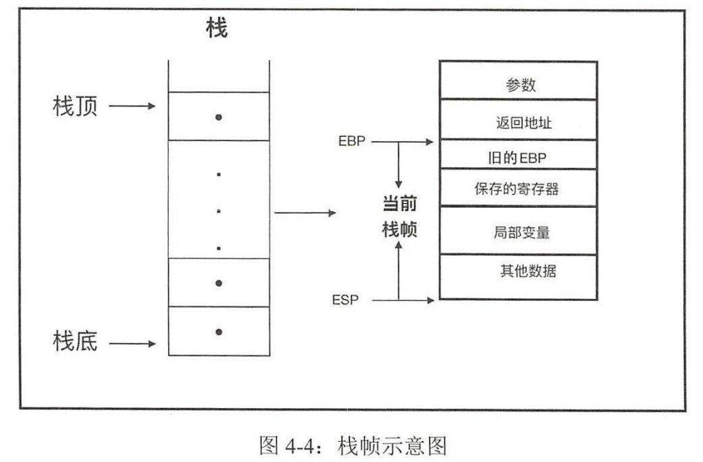

### [↑](#TOC)Day 4 (7.6)    

重点阅读《Rust 编程之道》
#### 1. 类型系统和所有权（Chapter-3/4/5）
+ 1.1 类型安全：  
    + 类型安全的语言可以避免类型间的无效计算
    + 类型安全的语言还可以保证内存安全
    + 类型安全的语言也可以避免语义上的逻辑错误
    + Rust 是一强类型且类型安全的静态语言。 Rust 中一切皆表达式 表达式皆有值，值皆有类型，所以可以说，Rust 中一切皆类型
+ 1.2 类型大小
    - &str 由两部分组成：指针和长度信息，这种包含了动态大小类型地址信息和携带了长度信息的指针，叫作**胖指针**（ Fat Pointer ，所以 str 是一种胖指针
    - 确大小类型/DST/ZST
    - 获得大小的方法
    ```rust
    let size = std::mem::size_of::<Foo>(); //
    ```
+ 1.3 底类型
    Rust 中有很多种情况确实没有值，但为了类型安全，必须把这些情况纳入类型系统进行统一处理。这些情况包括：
    - 发散函数 Diverging Function )
    - continue break 关键字
    - loop 循环
    - 空枚举，比如 enum Void{}


+ 1.4 类型推导
    - turbofish操作符：
    ```rust
    ::<>
    ```
    ```rust
    assert_eq!( x.parse::<i32>().unwrap(),1);  //示例
    ```
    > 在用 Rust 编程的时候， 应尽量显式声明类型 ，这样可以避免一些麻烦


+ 1.5 泛型
    - 泛型函数
    ```rust
    fn foo<T>(x:T) -> T{
        return x;
    }
    ```
    - 泛型结构体
    ```rust
    struct Point<T> {x : T, y : T} 
    ```
    


+ 1.6 trait
<span id="trait"></span>  
    - 接口中可以定义方法，并支持默认实现。
    - 接口中不能实现另 个接口，但是接口之间可以继承
    - 同一个接口可 以同时被多个类型实现 但不能被同一个类型实现多次
    - 使用 impl 关键字为类型实现接口方法。
    - 使用 trait 关键字来定义接口。
    **[书本](https://item.jd.com/12479415.html)p64**
    
        > 下图中两个类型参数 RHS和 Output 分别代表加法操作符右侧的类型和返回值的类型  
    
    
        > 字符串相加实现： Add<&str, String＞
        let c = a.to_string () + b; 
    
    - 孤儿规则:如果要实现某个 trait ，那么该 trait 和要实现该 trait 的那个类型至少有一个要在当前 crate 定义
    
    
    - 继承
    - trait 限定
    使用 trait 对泛型进行约束，叫作 trait 限定 trait Bound ）。格式如下
        ```rust
        fn geeric<T MyTrait + MyOtherTrait + SomeStandardTrait> (t : T) {} 
        ```
        > **[书本](https://item.jd.com/12479415.html)p71**
        如果为泛型增加较多的 trait 限定，代码可能会变得不太易读，比如下面这种写法
        fn foo<T : A, K: B+C , R: D> (a : T, b: K, c : R) {. . . }
        Rust 提供了 **where** 关键字， 用来对这种情况进行重构
        fn foo<T , K, R> (a: T, b : K, c : R) where T: A, K: B+C , R: D { . . }
        这样重构之后，代码的可读性就提高了
    + impt trait 
        impt Trait 语法用于返回值位置的时候，实际上等价于给返回类型增加一种 trait 限定范围

 
#### 2. 内存管理
<span id="内存管理"></span>
+ ！悬垂指针
+ 栈
    - 顶由枝指针寄存器 ESP 保存
    - Stack Frame：Activate Record
        > 栈上数据的生命周期都是在一个函数调用周期内的
        
+ 堆
    - Rust 编译器目前自带两个默认分配器： **alloc_system** alloc_jemalloc
+ 内存布局
    - 字节对齐（自然对齐）
+ Rust 资源管理
    - 常量/静态的生命周期是全局的
    - 常量没有固定的内存地址
    - 静态变量有固定的内存地址（因此它可以在unsafe代码块里面被改变）
    - Rust 中的字符串字面量存储于静态内存中的。
    - 在函数中定义的局部变 会被默认存储到栈中
    - Rust 编译器会对代码做基本的静态分支流程分析。


#### 3. 理解错误处理（Chapter-9） 

http://www.mamicode.com/info-detail-2884335.html
Rust处理异常的方法有4种：Option、Result<T, E>、线程恐慌（Panic）、程序终止（Abort）

+ 断言
```rust
macro_rules! assert_eq {
    ($left:expr, $right:expr) => { ... };
    ($left:expr, $right:expr,) => { ... };
    ($left:expr, $right:expr, $($arg:tt)+) => { ... };
}
```
```rust
fn main() {
    let a = Some("a");
    let b: Option<&str> = None;
    assert_eq!(a.expect("a is none"), "a");
    assert_eq!(b.expect("b is none"), "b is none");  //匹配到None会引起线程恐慌，打印的错误是expect的参数信息

    assert_eq!(a.unwrap(), "a");   //如果a是None，则会引起线程恐慌
    assert_eq!(b.unwrap_or("b"), "b"); //匹配到None时返回指定值
    let k = 10;
    assert_eq!(Some(4).unwrap_or_else(|| 2 * k), 4);// 与unwrap_or类似，只不过参数是FnOnce() -> T
    assert_eq!(None.unwrap_or_else(|| 2 * k), 20);
}
```
#### 4. 理解Unsafe（Chapter-13）
#### 5. https://github.com/rust-lang/rustlings