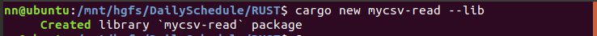
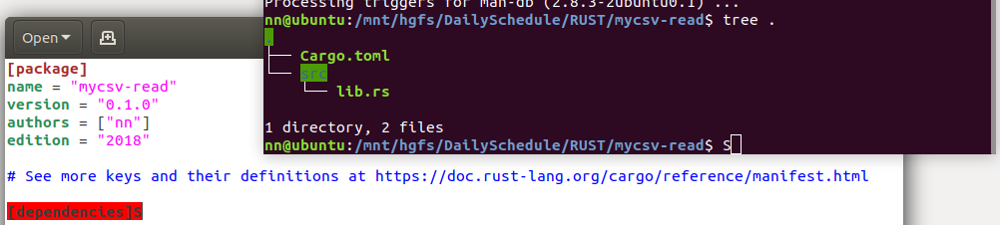
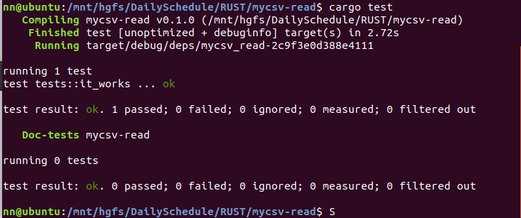
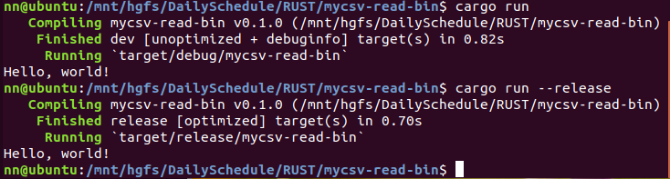
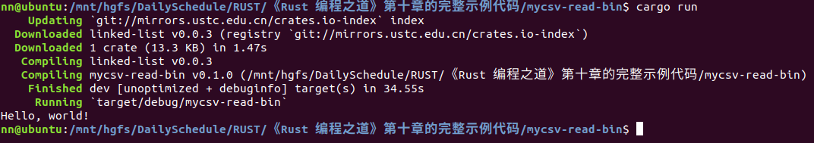
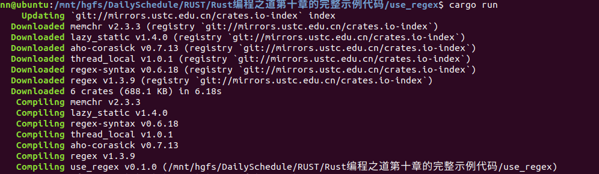

### [↑](#TOC)Day 4 (7.7)    

todo：

#### 完成《Rust 编程之道》第十章的完整示例代码，掌握Cargo和模块系统。
> cargo new 命令默认创建的是库文件（生成静态或动态链接库）  

> 目录结构  
  

> 测试test模块

> cargo run的debug和release模式选择（默认debug）
 

> 调用第三方crate  

> 添加正则表达式依赖

---